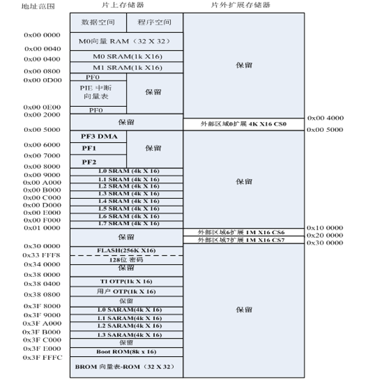

# DSP28335学习笔记

author:Lee
11-02-2024
version:1.0.0
这里是一个初学者学习DSP28335的学习笔记，如有不妥之处请指出，谢谢！

声明：本教程根据普中DSP28335教程总结而来，如有雷同，全是抄的（bushi
此教程本意是为了在原有教程上做一定补充，非盈利性目的。

## 一、写在前面

在使用DSP28335的时候，程序烧录过程中，请不要按下复位按键，否则芯片会锁死，想要完成开锁，可以参考网络上的一些资料，例如[https://bbs.elecfans.com/jishu_946759_1_1.html](https://bbs.elecfans.com/jishu_946759_1_1.html)这一部分，但本人未曾验证，请谨慎参考。网址上附带的压缩包文件，也已经存储在本工程中，如需自取。
同时，本人也只是一名在读学生，开发过程中如出现代码不规范等情况，敬请谅解。欢迎有志之士一起交流。

## 二、为什么要学习DSP28335

相信你如果能看到这个教程，一定是带着需求来学习的。至于DSP的外部资源，在这里便不做赘述，可以直接百度or淘宝。
在学习DSP28335之前，希望你能够拥有一定的单片机开发经验，较强的C语言基础，较好的电路基础，敢于多动手实践，这样学起来可以事半功倍。

## 三、DSP28335最小系统

### 3.1 最小系统组成

**1、电源电路**
在普中的开发板中，使用的是SY- 8088芯片来完成1.9V（给内核）和3.3V（芯片外设）电源的输出，接入时可以设计电源指示灯，用于反馈。同时可加稳压，单独供给外围外设。
**2、复位电路**
在普中的开发板中，可以参考的是他的RC电路设计，在开机时可自动复位。
再次提醒，一定不要在烧录时按下复位按键或者拔掉电源，否则芯片将会锁死！！！
**3、晶振电路**
在普中的开发板中，选择的晶振是30MHz，DSP28335工作最大频率是150MHz。XclkIN接地。
**4、下载电路（非必须）**
在普中的开发板中，下载使用的是JTAG，具体设计可以完全参考。

### 3.2 启动模式

通过GPIO84~GPIO87四个IO口来控制，对应的功能表如下所示：


对到左边为1，即为上拉。

## 四、软件安装、驱动安装、工程导入

这一步过程只需要参考教程上，便可一步步完成，需要关闭电脑病毒实时扫描，和内存安全性，并重启电脑生效。

## 五、存储器和寄存器

### 5.1寄存器映射

1、基本
存储器本身不具有地址信息，它的地址是由芯片厂商或用户分配，给寄存器分配地址的过程称为存储器映射，再分配地址称为重映射。
可以理解为C语言中的指针，p->0x0000H
片上资源有256Kx16位Flash、34Kx16的SRAM、8Kx16位的BOOT ROM，2Kx16的OPT ROM，采用统一寻址（程序、数据和IO统一寻址）。
采用多级流水线增强哈佛（还有一种弗洛依曼）结构，并行访问程序和数据存储空间。
下图为地址范围图，可供参考：


2、代码安全模块
通过一个128位的密码（相当于8个16位的字）来对安全区进行加密或解密。保存在Flash中的的最后8个字（0x33FFF8~0x33FFFF）即密码区，通过密码匹配，解锁器件。

## 六、工程模板

工程模板直接使用提供好的即可，在根目录下
DSP2833x_Libraries
|--DSP2833x_common
|   |--cmd，分配启动文件
|   |--gel，存放通用拓展
|   |--inlude，存放通用外设头文件
|   |--lib，存放运算库文件
|   |--source，通用外设源文件
|   |
|--DSP2833x_headers
|   |--cmd，存放操作系统所需文件
|   |--gel，相关外设
|   |--include，与common中对应的头文件
|   |--source，全局定义的文件
**创建工程模板的步骤**
①首先需要仿真调试或者flash烧写所需的.cmd文件和DSP的BIOS或nonBIOS .cmd文件。
②其次需要使用芯片的.ccxml目标配置文件。
③芯片内核及外设.c源文件，比如DSP2833x_Gpio.c、DSP2833x_PieCtrl.c等。
④芯片内核及外设.h头文件，比如DSP2833x_Gpio.h、DSP2833x_PieCtrl.h等。
⑤DSP .lib库文件，常用的如IQmath.lib等。

## 七、时钟及其控制系统

### 7.1 外部时钟接入方式


外部时钟源信号接入方法有2种，分别针对的是电压为3.3V的外部时钟和1.9V的外部时钟。
（1）外部时钟信号接入方式1，即采用3.3V的外部时钟。

（2）外部时钟信号接入方式2，即采用1.9V的外部时钟。


### 7.2 时钟结构


下图为常用寄存器


```C
//#define DSP28_DIVSEL   0   // Enable /4 for SYSCLKOUT
#define DSP28_DIVSEL   1 // Disable /4 for SYSCKOUT
//#define DSP28_DIVSEL     2 // Enable /2 for SYSCLKOUT
//#define DSP28_DIVSEL     3 // Enable /1 for SYSCLKOUT

//#define DSP28_PLLCR   10
//#define DSP28_PLLCR    9
//#define DSP28_PLLCR    8
//#define DSP28_PLLCR    7
//#define DSP28_PLLCR    6
//#define DSP28_PLLCR    5
//#define DSP28_PLLCR    4
#define DSP28_PLLCR    3
//#define DSP28_PLLCR    2
//#define DSP28_PLLCR    1
//#define DSP28_PLLCR    0  // PLL is bypassed in this mode
```

上面所展示的代码为官方提供的文件中，对其进行模块化处理的代码

## 八、点亮第一个LED灯

### 8.1 管脚分类


此芯片共有 176 引脚，类型如下：
（1）电源引脚
（2）晶振引脚
（3）复位引脚
（4）下载引脚
（5）BOOT引脚
（6）GPIO 引脚
同时，GPIO引脚分为A、B、C三组，范围分别是
A组：GPIO0——GPIO31
B组：GPIO32——GPIO63
C组：GPIO64——GPIO87
在这里主要影响的是PCLKCR1、2、3寄存器的选择

### 8.2 GPIO结构框图


滤波+采样来实现去除毛刺信号


### 8.3 LED实验程序

对于部分没有使用过条件编译的读者来说，这里特别说明一下，条件编译的代码格式如下

```C
#ifndef __YOURCODE_H_  //if判断语句，用来判断有没有定义，如果没有定义，直接跳转到endif
#define __YOURCODE_H_   //如果未定义，则定义，防止重复定义，造成资源浪费

···
···
#endif
```

下面是普中提供的一个GPIO的案例

```C
/*******************************************************************************
* 函 数 名         : LED_Init
* 函数功能         : LED初始化函数
* 输    入         : 无
* 输    出         : 无
*******************************************************************************/
void LED_Init(void)
{
    EALLOW;//关闭写保护,修改GPIO引脚功能的时候必须执行

    SysCtrlRegs.PCLKCR3.bit.GPIOINENCLK = 1;    // 开启GPIO时钟

    //LED1端口配置
    GpioCtrlRegs.GPCMUX1.bit.GPIO68=0;//设置为通用GPIO功能
    GpioCtrlRegs.GPCDIR.bit.GPIO68=1;//设置GPIO方向为输出
    GpioCtrlRegs.GPCPUD.bit.GPIO68=0;//使能GPIO上拉电阻

    GpioDataRegs.GPCSET.bit.GPIO68=1;//设置GPIO输出高电平

    EDIS;//开启写保护
}
```

## 九、蜂鸣器

### 9.1 硬件部分

对于普中的开发板，上面采用的是无源蜂鸣器，在对其进行驱动的时候，需要提供1.5~5KHz的频率，这一步目前可以通过使用delay函数来粗略完成，等之后学习过pwm波即可完成更加精细的操作
同时，因为板载驱动能力有限，在这里，采用ULN2003D芯片来驱动。需要注意的是，其引脚间连接有非门，故输出会发生转换
对于有源蜂鸣器的设计电路，这一部分可以参考CSDN上的一些文章，叙述已经十分完全，在此就不做赘述。下面提供一个普中的有源蜂鸣器电路，采用PNP三极管外加上拉电阻的结构实现。


### 9.2 软件部分

下面是一些相关的代码，仅供参考，由于普中官方的代码已经十分简略实用，在这里没有怎么修改

```C
//BEEP.H
/*
 * beep.h
 *
 *  Created on: 12/3/2024
 *      Author: Lee
 */

#ifndef HARDWARE_BEEP_BEEP_H_
#define HARDWARE_BEEP_BEEP_H_


#include "DSP2833x_Device.h"     // DSP2833x Headerfile Include File
#include "DSP2833x_Examples.h"   // DSP2833x Examples Include File

#define BEEP_ON        (GpioDataRegs.GPASET.bit.GPIO6=1)
#define BEEP_OFF       (GpioDataRegs.GPACLEAR.bit.GPIO6=1)
#define BEEP_TOGGLE    (GpioDataRegs.GPATOGGLE.bit.GPIO6=1)

void BEEP_Init(void);

#endif /* HARDWARE_BEEP_BEEP_H_ */

```

```C
//BEEP.C
/*
 * beep.c
 *
 *  Created on: 12/3/2024
 *      Author: Lee
 */

#include "beep.h"

void BEEP_Init(void)
{
    EALLOW;
    SysCtrlRegs.PCLKCR3.bit.GPIOINENCLK = 1;//开启GPIO时钟
    //端口配置
    GpioCtrlRegs.GPAMUX1.bit.GPIO6=0;
    GpioCtrlRegs.GPADIR.bit.GPIO6=1;
    GpioCtrlRegs.GPAPUD.bit.GPIO6=0;

    EDIS;

    GpioDataRegs.GPACLEAR.bit.GPIO6=1;

}

```

关于在开发中定义变量，个人建议在DSP2833x_Device.h头文件中找到这样一行,其中预先定义了各个数据格式，如果使用int或者其他数据类型，在开发过程中造成数据位数遗忘，这将会是一件非常危险的事。

```C
//---------------------------------------------------------------------------
// For Portability, User Is Recommended To Use Following Data Type Size
// Definitions For 16-bit and 32-Bit Signed/Unsigned Integers:
//

#ifndef DSP28_DATA_TYPES
#define DSP28_DATA_TYPES
typedef int             int16;
typedef long            int32;
typedef unsigned int    Uint16;
typedef unsigned long   Uint32;
typedef float           float32;
typedef long double     float64;
#endif
```

```C
//main
void main()
{
    Uint16 i = 0;
    InitSysCtrl();//系统时钟初始化，默认已开启F28335所有外设时钟

    LED_Init();
    BEEP_Init();

    while(1)
    {
        i++;
        if(i == 5000)//每隔0.5s跳变一次
        {
            LED_TOGGLE;
            i = 0;
        }
        BEEP_TOGGLE;
        DELAY_US(100);//5KHz
    }

}
```

读者可能会发现，在这一行代码中，使用到了DELAY_US()这个函数，这个函数在配置文件中的DSP2833x_usDelay.asm文件下存放，在DSP2833x_Examples.h函数下定义

```C
#define DELAY_US(A)  DSP28x_usDelay(((((long double) A * 1000.0L) / (long double)CPU_RATE) - 9.0L) / 5.0L)
```

特别需要注意的是，我们阅读这个函数，会发现后面会传递一个long double类型的CPU_RATE类型的变量，这个变量与机器时钟息息相关，我们进入之后可以发现，里面是这么解释的：

```c
/*-----------------------------------------------------------------------------
      Specify the clock rate of the CPU (SYSCLKOUT) in nS.

      Take into account the input clock frequency and the PLL multiplier
      selected in step 1.

      Use one of the values provided, or define your own.
      The trailing L is required tells the compiler to treat
      the number as a 64-bit value.

      Only one statement should be uncommented.

      Example 1:150 MHz devices:
                CLKIN is a 30MHz crystal.

                In step 1 the user specified PLLCR = 0xA for a
                150Mhz CPU clock (SYSCLKOUT = 150MHz).

                In this case, the CPU_RATE will be 6.667L
                Uncomment the line:  #define CPU_RATE  6.667L

      Example 2:  100 MHz devices:
                  CLKIN is a 20MHz crystal.

                  In step 1 the user specified PLLCR = 0xA for a
                  100Mhz CPU clock (SYSCLKOUT = 100MHz).

                  In this case, the CPU_RATE will be 10.000L
                  Uncomment the line:  #define CPU_RATE  10.000L
-----------------------------------------------------------------------------*/
#define CPU_RATE    6.667L   // for a 150MHz CPU clock speed (SYSCLKOUT)
//#define CPU_RATE    7.143L   // for a 140MHz CPU clock speed (SYSCLKOUT)
//#define CPU_RATE    8.333L   // for a 120MHz CPU clock speed (SYSCLKOUT)
//#define CPU_RATE   10.000L   // for a 100MHz CPU clock speed (SYSCLKOUT)
//#define CPU_RATE   13.330L   // for a 75MHz CPU clock speed (SYSCLKOUT)
//#define CPU_RATE   20.000L   // for a 50MHz CPU clock speed  (SYSCLKOUT)
//#define CPU_RATE   33.333L   // for a 30MHz CPU clock speed  (SYSCLKOUT)
//#define CPU_RATE   41.667L   // for a 24MHz CPU clock speed  (SYSCLKOUT)
//#define CPU_RATE   50.000L   // for a 20MHz CPU clock speed  (SYSCLKOUT)
//#define CPU_RATE   66.667L   // for a 15MHz CPU clock speed  (SYSCLKOUT)
//#define CPU_RATE  100.000L   // for a 10MHz CPU clock speed  (SYSCLKOUT)
```

上面的英文可以自行观看一下，在时钟定义那一节里面，我们会修改系统时钟，如果系统时钟修改之后，为了让DELAY_US函数延迟依然准确，我们也需要在这里选择对应的机器周期所对应的CPU_RATE。
所以没事，别闲的改机器周期。

## 十、继电器

### 10.1 硬件部分

在普中的开发板设计当中，由于板载驱动能力有限，所以在这里依然选择ULN2003D来完成驱动，其驱动引脚为GPIO15。
在电路设计中，电磁线圈后加的二极管是为了防止在电磁线圈失电后产生的电动势过大，损坏芯片。
这里的电路比较简单，就不附图了，可以自行查看原理图。

### 10.2 软件部分

笔者在这里因为太懒了，不想敲了，直接CV的代码

```c
/*
 * relay.h
 *
 *  Created on: 2018-1-22
 *      Author: Administrator
 */

#ifndef RELAY_H_
#define RELAY_H_


#include "DSP2833x_Device.h"     // DSP2833x 头文件
#include "DSP2833x_Examples.h"   // DSP2833x 例子相关头文件


#define RELAY_ON    (GpioDataRegs.GPASET.bit.GPIO15=1)
#define RELAY_OFF   (GpioDataRegs.GPACLEAR.bit.GPIO15=1)


void Relay_Init(void);


#endif /* RELAY_H_ */

```

```c
/*
 * relay.c
 *
 *  Created on: 2018-1-22
 *      Author: Administrator
 */

#include "relay.h"


void Relay_Init(void)
{
    EALLOW;
    SysCtrlRegs.PCLKCR3.bit.GPIOINENCLK = 1;// 开启GPIO时钟

    //继电器端口配置
    GpioCtrlRegs.GPAMUX1.bit.GPIO15=0;
    GpioCtrlRegs.GPADIR.bit.GPIO15=1;
    GpioCtrlRegs.GPAPUD.bit.GPIO15=0;

    EDIS;

    GpioDataRegs.GPACLEAR.bit.GPIO15=1;
}

```
